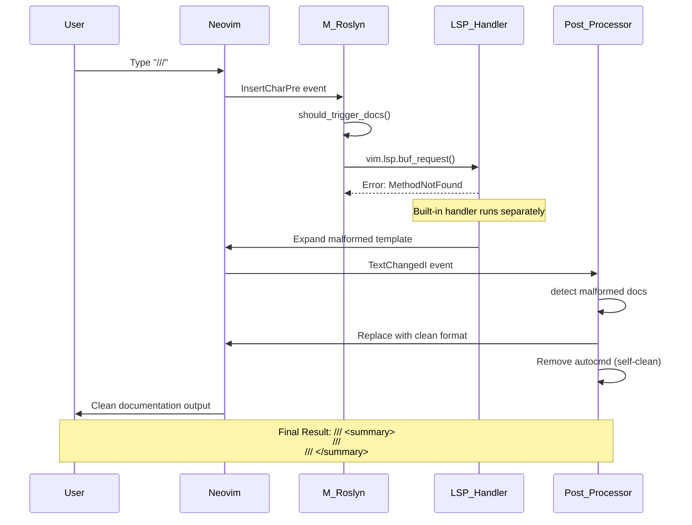

# M_Roslyn: Modular Enhancements for roslyn.nvim

Modular enhancements for roslyn.nvim following the established m_augment pattern for extensible LSP enhancements.

## Features

### C# Documentation Auto Insert

Automatically expands `///` to XML documentation template using LSP integration with post-processing cleanup.

#### Usage

Type `///` above a C# method, class, or property to automatically generate:

```csharp
/// <summary>
/// 
/// </summary>
/// <param name="paramName">Description</param>
/// <returns>Description</returns>
```

#### Implementation Flow



#### Technical Details

**Hybrid Approach**: The implementation uses a hybrid approach due to LSP method limitations:

1. **Primary Handler**: Attempts `textDocument/_vs_onAutoInsert` LSP request (fails gracefully)
2. **Secondary Handler**: Built-in roslyn handler provides actual functionality but with malformed output
3. **Post-Processor**: Detects and cleans up malformed documentation, then removes itself

**Key Components**:
- `auto_insert_docs.lua` - Main documentation auto-insert functionality
- `health.lua` - Health check integration (`:checkhealth m_roslyn`)
- `init.lua` - Module setup and configuration

## Configuration

```lua
require('m_roslyn').setup({
  auto_insert_docs = {
    enabled = true,        -- Enable documentation auto-insert (default: true)
    debug = false,         -- Enable debug notifications (default: false)
    trigger_pattern = "///", -- Pattern to trigger auto-insert (default: "///")
  }
})
```

## Commands

```lua
-- Enable/disable documentation auto-insert
require('m_roslyn.auto_insert_docs').enable()
require('m_roslyn.auto_insert_docs').disable()
require('m_roslyn.auto_insert_docs').toggle()

-- Get current configuration
require('m_roslyn.auto_insert_docs').get_config()
```

## Health Check

Run `:checkhealth m_roslyn` to verify:
- roslyn.nvim plugin availability
- Active roslyn LSP clients
- vim.snippet support
- .NET environment
- Current buffer context

## Requirements

- Neovim 0.10+ (for vim.snippet support)
- roslyn.nvim plugin
- .NET SDK
- C# filetype detection

## Integration

This module is automatically loaded when roslyn.nvim is configured. It integrates with the existing roslyn plugin configuration in `lua/plugins/roslyn.lua`.

## Troubleshooting

**Debug Mode**: Enable debug mode to see detailed notifications:
```lua
require('m_roslyn.auto_insert_docs').setup({debug = true})
```

**Common Issues**:
- LSP method not supported: This is expected - the fallback handler provides functionality
- Double documentation: Post-processor should clean this up automatically
- No response: Check `:checkhealth m_roslyn` for configuration issues

## Architecture

**Design Pattern**: Follows the m_augment modular pattern for consistency with other LSP enhancements.

**Self-Cleaning**: The post-processor removes its autocmd after processing to avoid background overhead.

**Graceful Degradation**: If LSP methods fail, the system falls back to alternative handlers while maintaining clean output.
